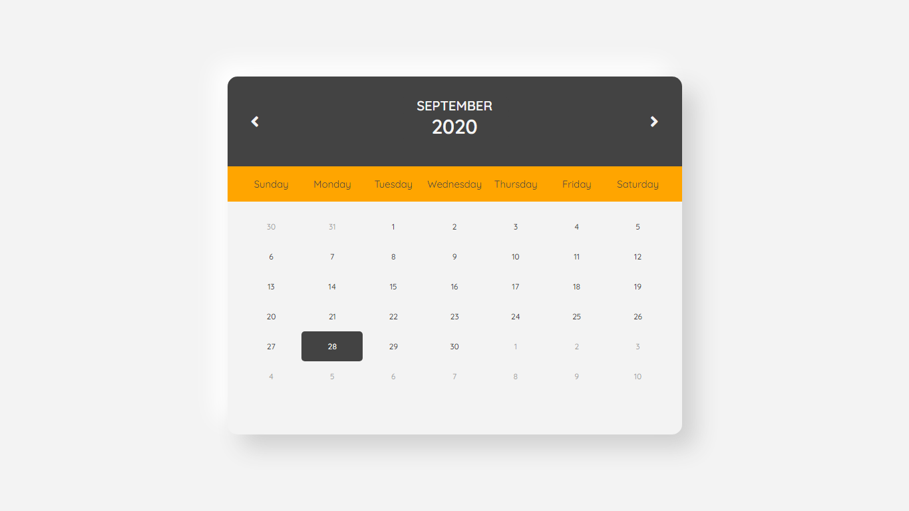
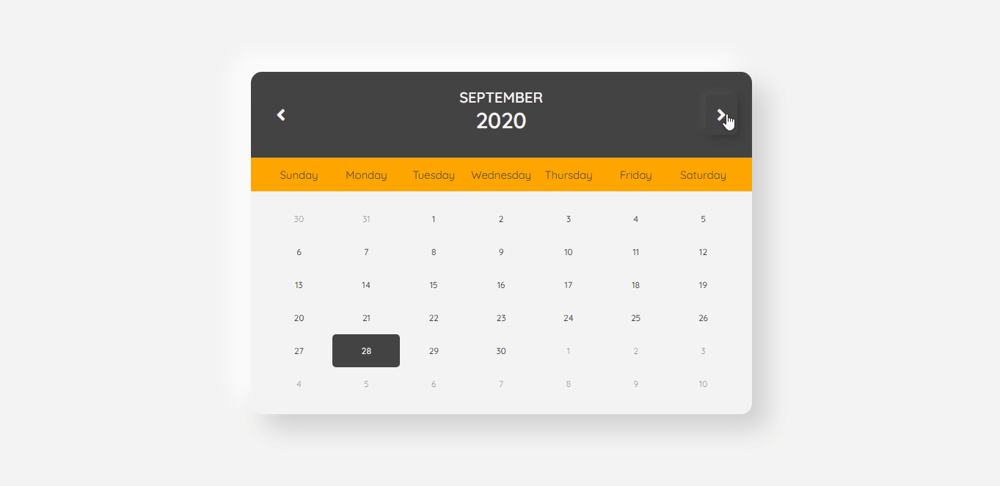
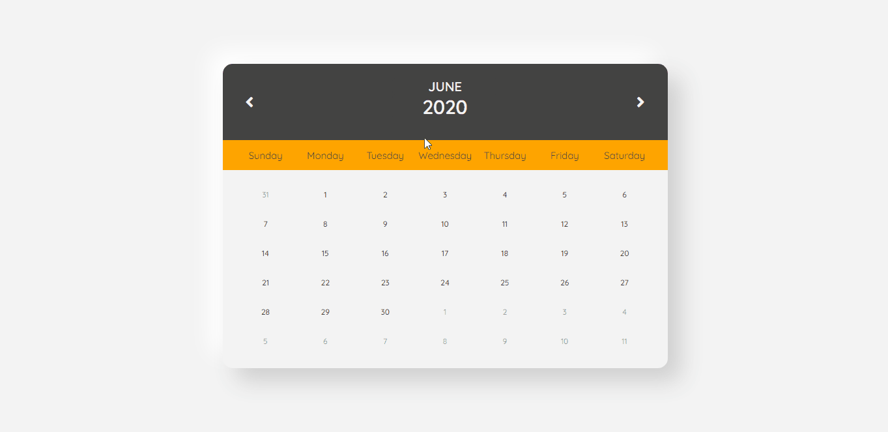

# Calendar
## Description
in Javascript : enumerate all properties in Date Object

Create a simple program :
  * Receive inputs : Month & Year
  * Present the Calendar of That Month (with 7 days format - Sunday to Saturday)
  
## Languanges
* HTML
* CSS
* Javascript

## Preview

## Features
1. Next/Previous Month

2. Input Month

3. Input Year

